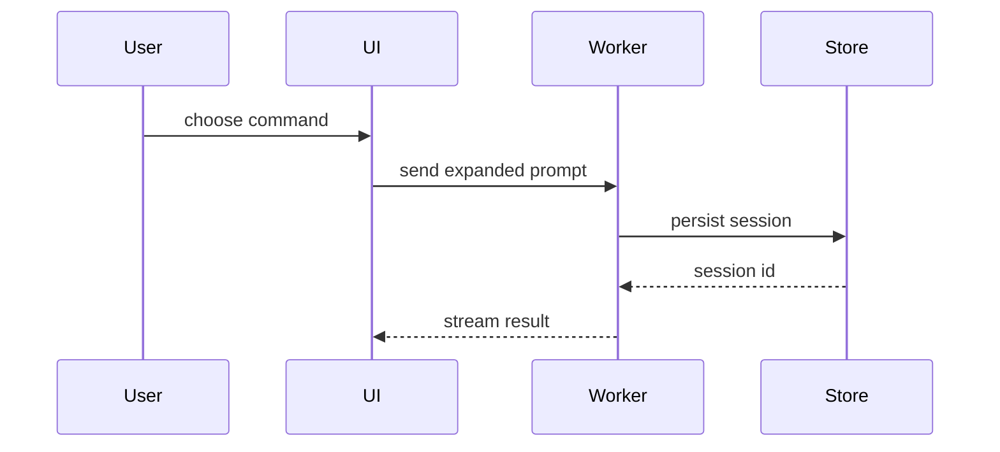
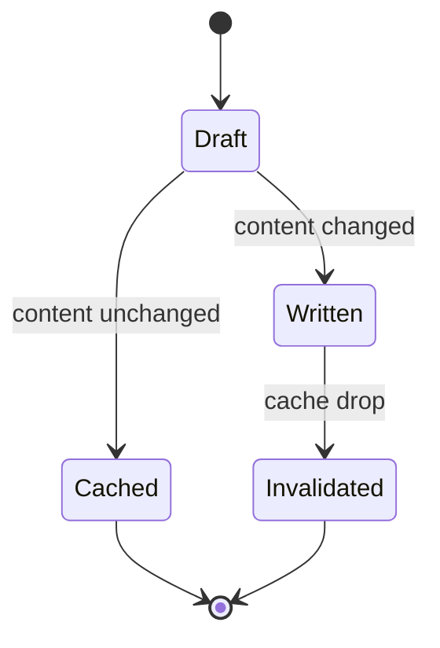

# Make PR reference

## Body structure

Load during Step 2 after the locked diff is non-empty. Measure only that
diff:

| Metric  | Source                                                                   |
| ------- | ------------------------------------------------------------------------ |
| `files` | count of paths in `git diff --name-only <target>...HEAD`                 |
| `churn` | sum of added and deleted lines from `git diff --numstat <target>...HEAD` |
| `areas` | count of distinct top-level path segments among those files              |

Pick **exactly one** depth with this order (first match wins):

1. **deep** when `files` > 12, or `churn` > 400, or (`areas` ≥ 4 and `files` ≥ 8).
2. **shallow** when `files` ≤ 3 and `churn` ≤ 80.
3. **standard** for every other non-empty diff.

Record `depth` in the ledger next to title/body so Step 4 can restate it.

### Skeleton

Every body uses this shape (optional header first):

1. Link header only when the user pasted one or more URLs in the make-pr
   request. One line of `[label](url)` joined by ` | `, using those exact
   URLs. Labels may be the host or a user-supplied label. Never invent
   tickets or plans. Pasted URLs do not authorize ticket or motive claims
   below.
2. `## Why the change` then exactly one sentence.
3. `## Special things to note` then 1-3 bullets, or a single `- None.`
4. `## Change outline` then captions and views only.

No other `##` headings. No `## Summary`, `## Details`, `## Breaking`, or
`## Visuals`.

### Why the change

Exactly one sentence naming the proved behavior change after merge: what
callers or users of the code can do or observe differently. Ground it only
in the locked diff. An explicit title ticket does not authorize ticket
claims here. Do not write product motive, opportunity, or problem framing
the hunks do not prove.

### Special things to note

Only proved reviewer hazards: breaks, migrations, compatibility
constraints, deliberate omissions, or surprising API or shape shifts
visible in the hunks, or restating explicit user wording from the make-pr
request. Cap at three bullets. If none apply, write `- None.`

### Draft procedure

1. Measure `files`, `churn`, and `areas`. Select depth.
2. Cluster hunks into themes. Never one theme per commit.
3. Emit the optional link header when the request pasted URLs.
4. Write Why (one proved sentence). Rewrite if a second sentence or
   unproved motive appears.
5. Write Special from proved hazards, else `- None.`
6. Draft Change outline per the next section.
7. Apply Body style to Why, Special, and captions. Fence interiors keep
   the view's syntax.
8. Map every title phrase, body line, caption, and visual label to
   proving paths and hunks. Rewrite untraced copy.

Done when skeleton, depth, Body style, Change outline, and clean-room
trace all pass.

Rules:

- Cover every theme that needs a view or a Special bullet. Do not pad.
- Prefer proved captions plus views over vague prose.
- Include no test, rollout, unproved motive, or unproved ticket claim.
- Never draft harness footers (`Made with Cursor`, identity trailers,
  peers).

## Change outline

Load during Step 2 after themes exist. This section is the only
implementation surface. Each included item is an optional short caption
plus one fenced view. Place the caption next to its fence.

### Depth

| Depth    | Captions                                                                 | Views                                                                                          |
| -------- | ------------------------------------------------------------------------ | ---------------------------------------------------------------------------------------------- |
| shallow  | At most one short caption per view; omit the caption when the fence is clear | Prefer 1-2 views total; stop when the proved shape is clear                               |
| standard | One short caption per view when the fence alone is ambiguous             | Include each distinct proved shape category that helps; no duplicate shapes                    |
| deep     | Caption required when a view spans a module boundary or contract         | Multiple views OK when one leaves a boundary unclear; still omit unused categories             |

### Selection

Include only views that help a reviewer understand this PR. Omit
categories that did not change. Prefer one clear view over several
overlapping ones. Use a second view only when the first leaves a
boundary, call, or layout unclear. Prefer `diff` when an existing shape
changes. Prefer a full or language block when most of the shape is new,
omitted names hide order, or a copyable target is needed. Order views so
the story is easiest to follow (contract or data first, or files first,
as the diff suggests). Do not emit every matching row by default.

### Fence rules

A fence may include only names, calls, files, props, states, types,
columns, routes, and boundaries the locked diff proves. Delete any
color, spacing, viewport, label, or datum the hunks omit. Include no
test, rollout, or unproved motive. Publishable fences only: `text`,
`diff`, language fences (`ts`, `tsx`, `sql`, `json`, and peers), and
`mermaid`. Do not write an `html` fence. Do not link an HTML file.
make-pr blocks untracked files and never commits, so a new artifact
cannot publish.

### Pick the views

For each theme, consider every proved shape in the table. Include a view
only when selection above says it helps.

| Theme shape                                                                        | View                             |
| ---------------------------------------------------------------------------------- | -------------------------------- |
| Logic or algorithm                                                                 | Pseudocode in a `text` fence     |
| Runtime control flow                                                               | Call tree in a `text` fence      |
| UI structure with state or module bounds                                           | Component tree                   |
| File responsibility or a broad refactor                                            | Shallow file tree                |
| Interaction, control, or data flow                                                 | Mermaid                          |
| Schema, SQL table or column, or relationship change                                | `sql` or `diff` of that shape    |
| HTTP or RPC endpoint request/response or route contract change                     | `diff` or language fence of the contract |
| Key data structure, type, or interface central to the change                       | Language fence or `diff` of the type |
| Existing shape with a delta                                                        | `diff` sketch of that same shape |
| Most of the shape is new, omitted names hide order, or a copyable target is needed | Full block                       |

Match only names, calls, files, props, states, types, columns, routes,
and boundaries in the locked diff.

### Views

**Pseudocode.** Put logic or an algorithm in a `text` fence. Name each
branch, guard, and result the hunks prove. Keep the indent as the
control-flow nest.

```text
on(save)
  if content is unchanged
    return cached result
  write new content
  invalidate cache
  return fresh result
```

**Call tree.** Put runtime control flow in a `text` fence. Name the
entry, each callee, and the order the hunks prove. Nest children under
the caller. Keep sibling calls at the same indent.

```text
submitForm
  validateCart
  createSession
    persistPrompt
    attachReceipt
    launchAgent
  navigateToSession
    subscribeToEvents
```

**Component tree.** Name UI structure, plus every state hook and module
bound the hunks prove. Put the owning path beside a node that crosses
a package or route.

```tsx
<CheckoutPage> (apps/web/src/routes/checkout.tsx)
  useCart()
  useCheckoutSession()
  <CheckoutToolbar>
    <PayButton> (packages/ui)
    <PromoField>
  <CheckoutTimeline>
    <ReceiptCard> (packages/ui)
```

**File tree.** Put a responsibility map or broad refactor in a shallow
tree. Name each top directory the hunks touch and the job it owns. Do
not hide a moved or split path.

```text
src/
├── commands/       # parses user actions
│   └── parseCommand.ts
├── sessions/       # owns session state
└── transport/      # sends API requests
    ├── client.ts
    └── stream.ts
```

**Mermaid.** Put interaction, control flow, or data flow in a `mermaid`
fence. Name each participant or node the hunks prove. Add a second
Mermaid diagram when sequence and state are both in the diff.





**Schema.** Put table, column, or relationship deltas in `sql` or
`diff`. Keep only names and constraints the hunks prove.

```diff
 CREATE TABLE sessions (
   id TEXT PRIMARY KEY,
-  prompt TEXT NOT NULL
+  prompt TEXT NOT NULL,
+  receipt_id TEXT REFERENCES receipts(id)
 );
```

**Endpoint contract.** Put route, request, or response shape changes in
`diff` or a language fence. Keep only fields and status codes the hunks
prove.

```diff
 POST /v1/sessions
   body: { prompt: string }
-  200: { id: string }
+  200: { id: string, receiptId: string }
```

**Key type.** Put a central type or interface in a language fence or
`diff`. Keep the real field names the hunks prove.

```ts
type Session = {
  id: string;
  prompt: string;
  receiptId: string;
};
```

**Diff sketch.** Match the `diff` fence to the theme's shape. Emit one
fence per changed shape. Keep unchanged neighbors that fix ownership
or order.

Component change:

```diff
 <CheckoutPage>
   useCart()
   <CheckoutToolbar>
+    <PayButton />
   <CheckoutTimeline>
+    <ReceiptCard />
```

File-layout change:

```diff
 src/
 ├── commands/
+│   └── parseCommand.ts  # parses the slash command
 ├── sessions/
-└── transport.ts
+└── transport/
+    ├── client.ts
+    └── stream.ts
```

Call-tree change:

```diff
 submitForm
   createSession
     persistPrompt
+    attachReceipt
     launchAgent
-  navigateToSession
+  navigateToSession
+    subscribeToEvents
```

State or control-flow change:

```diff
 on(save)
-  write content
+  if content is unchanged
+    return cached result
+  write new content
+  invalidate cache
```

**Full block.** Put the whole block when most of it is new, when omitted
names would hide ownership or order, or when the reviewer needs a
copyable target shape. Keep the real signature, return shape, and
callee names the hunks prove.

```ts
function parseCommand(input: string): Command {
  const name = input.slice(1);
  const args = input.split(/\s+/).slice(1);
  return { name, args };
}
```

## Body style

Write as one human talking to another: simple, coherent, and concise.
Apply this to Why, Special, and Change outline captions (not to path or
symbol literals, and not inside fences).

- Keep one topic per sentence and one idea per bullet.
- Write active voice. Name the actor when it matters.
- Use a list when three or more parallel points appear.
- Address the reviewer as you for instructions. Use third person for
  what the code does.
- Keep articles when they make grammar clear. Use American spelling.
- Keep necessary technical nouns. Put code, flags, and paths in code
  font.
- Use sentence-case headings (`## Why the change`, `## Special things to
  note`, `## Change outline`). Use serial commas.
- Do not soften claims with empty hedges. If the diff does not prove a
  claim, delete the claim.

### Avoid AI tells

Keep these bans. Human tone does not license AI cadence.

- Avoid em dashes entirely. Use periods or commas only. Do not use
  parentheses, en dashes, or hyphen-as-dash substitutes for the same
  role.
- Do not write "not just X, but Y" or "X, not Y" contrast templates.
  State the point directly.
- Use one plain word for one act. Do not rotate synonyms.
- Do not force a rule of three. Use the natural count.
- Avoid AI vocabulary such as additionally, crucial, delve, enhance,
  fostering, pivotal, showcase, tapestry, testament, underscore, and
  vibrant.
- Replace "serves as", "stands as", "boasts", and "features" with "is"
  or "has" when that is the meaning.
- Use colons only before a list or example. Rewrite mid-sentence colon
  connectors as direct sentences.
- Do not write we, let's, please, simply, easy, quickly, slang, or
  tl;dr. Do not use exclamation marks.
- Replace "in order to" with "to", "due to the fact that" with
  "because", and delete "it is important to note that".
- Prefer plain words: use over utilize or leverage, help over
  facilitate, many over numerous, if over in the event that.
- Use straight quotes. Do not bold every proper noun. No decorative
  emojis.

Title lines: Pope/Beams imperative, no trailing period. Default title
uses sentence case and stays at most 60 characters. Conventional title
follows commit conventional rules (lowercase except names and technical
terms, 50 characters, no scope, imperative, no period).

Provenance for titles only:
https://tbaggery.com/2008/04/19/a-note-about-git-commit-messages.html
https://cbea.ms/git-commit/

## Body hygiene

Load only during Step 4 verify after a create or update.

The published PR body must equal the ledger body. Harnesses and platform
hooks often append marketing footers after create or edit.

Banned additions (case-insensitive; strip whether freeform or `Key: value`):

- `Made with Cursor`, `Made-with: Cursor`, or Cursor product links used as a
  footer
- `Generated with Claude`, `Generated with Claude Code`, or similar Claude
  Code marketing lines
- `Co-authored-by:` / `Signed-off-by:` identity trailers in the PR body
- Any trailing block after the ledger body separated by a blank line that the
  ledger did not include

Detect: read the PR body back. Normalize only a single trailing newline for
comparison. Any other difference from the ledger body is dirty.

When dirty:

1. Update the PR body once to the exact ledger body. Change no other field.
2. Re-read the body. Any remaining difference from the ledger is `BLOCKED`;
   report the leftover lines.
3. Report whether a body strip ran.

Never draft banned footers in Step 2. Never treat a harness footer as part of
the body. A user-pasted link header that belongs in the ledger body is not a
harness footer; keep it.
