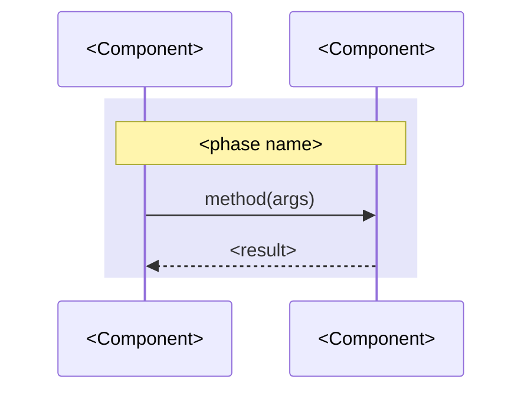

# Upfront design reference

Load the section for the step being entered. Rules live in `SKILL.md`; this
file holds templates and conditional wiring views.

## Design document template

Load in Step 0 when creating the file. Write one section per approved phase;
leave later sections absent until their phase is approved. Prose comes first
and each fenced block sits beside the prose it supports. Store repo roots as
absolute paths.

````markdown
---
request: <one-line request, or the path or URL it came from>
repos:
  - <absolute repo root>
created: <YYYY-MM-DD>
status: draft
---

# Design: <short title>

## Product review

### Problem to solve

<One paragraph: who starts where and what is missing.>

- <Concrete pain, quoting what the user does or says today>

### Success and how to measure it

- <Outcome stated as a change in behavior>
- Measurable signals: <counts, rates, or deltas readable from data>

### Proposed solution

**<One-line shape of the solution.>** <How it works and where it lives.>

<Mockup: supplied image path, or a text wireframe or state table labelled draft.>

<Delivery paragraph: how the user reaches it and how it ships.>

## System design

**<One-line shape statement naming the existing pattern it follows.>**
<Paragraph: what it parallels and what stays unchanged.>

```text
<contract path>    NEW        <role>
<api path>         CHANGED    <role>
<ui path>          NEW        <role>
```

<Paragraph: data sources, constraints, and the cost reason for each.>

ADR conflicts: <ADR-NNNN and the conflict, or none>



## Program design

### <Boundary thesis as one sentence>

Inherited pattern: <repo path and symbol, or an explicit assumption>.
<Changed contract, constraints, and intentional deviations.>

```<lang>
<usage snippet with real signatures and types>
```

```diff
 <dir>/
+  <new file>        # <role>
   <existing file>   # unchanged
```

Outcomes: <Success outcome → symbol/contract → expected result, including
relevant failures>.
<Additional wiring view only if the Wiring views trigger applies.>
<Paragraph: second shape considered and why it lost, or omit.>

## Vertical slices

- [ ] M1 <title>: <behavior delivered>
  - Path: <layers touched; begin with the thinnest end-to-end slice exposing
    contracts and checks, then expand logic and failure handling>
  - Symbols: <Phase 3 names landed here>
  - Expected outcomes: <observable success and relevant failure behavior>
  - Automated verification:
    - [ ] `<exact command>` <assertion/check → expected outcome it proves;
      caveat when the path or package matters>
  - Manual verification:
    - [ ] <step → expected outcome and observable result>
  - Deviations: none, or promised X; landed Y; reason
- [ ] M2 <title>: <behavior delivered> deferred (<reason or ticket>)

## Decisions

- <decision>: ADR at <absolute path>, or recorded here only
````

## Wiring views

Choose the smallest view that shows the unclear interaction; do not render
every view for every boundary.

- Caller map: group real call sites by boundary and mark added calls.
- Call graph: trace the affected path from its entry point, naming real symbols.
- Sequence: show ordering, dispatch, or asynchronous handoffs that signatures
  cannot express.

## ADR template

Load in Step 5 only, after a decision passes all three tests: hard to reverse,
surprising without context, chosen over a real alternative.

Qualifying categories: architectural shape, integration pattern between
components, technology that would take a quarter to swap, boundary and scope
no-s, deliberate deviation from the obvious path, non-obvious rejected
alternative.

Numbering: scan the ADR tree for the highest `NNNN-` prefix and add one. Name
the file `NNNN-<slug>.md`. Create the tree only when writing the first ADR.

```markdown
# <Short title of the decision>

<One to three sentences: the context, the decision, and why.>
```

Optional sections, added only when they carry information the body lacks:
`Status` (`proposed`, `accepted`, `deprecated`, `superseded by ADR-NNNN`),
`Considered Options`, `Consequences`.

## Check report format

Load in Check only.

```text
milestone: M<n> <title>
automated:
  `<command>` | expected <outcome> | evidence <assertion/result> | pass | fail (exit <code>)
manual:
  <step> | expected <outcome> | observed <result> | confirmed | unconfirmed
symbols:
  <promised name and signature> | landed | missing | changed: <detail>
outcomes:
  <approved Success/milestone outcome> | proved <evidence> | missing | contradicted
result: ticked | awaiting manual | awaiting outcome | deviation
next: <first still-open M<n>> | all milestones complete
deferred: <M<n> and unlanded symbols, or none>
```

## Legacy outcomes

When expected outcomes are absent, derive them from approved Success and
milestone text without changing those requirements. If an outcome cannot be
derived or is ambiguous, name it, leave the milestone open, and stop with
`AWAITING_USER` for clarification.
