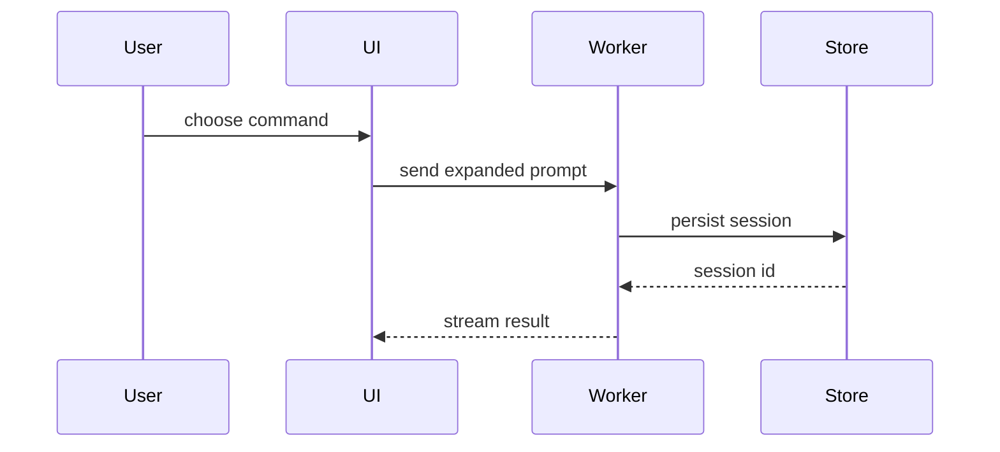
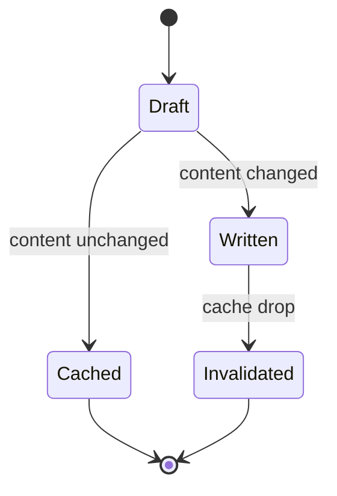

# Make PR reference

## Body scale

Load during Step 2 after the locked diff is non-empty. Measure only that
diff:

| Metric | Source |
|---|---|
| `files` | count of paths in `git diff --name-only <target>...HEAD` |
| `churn` | sum of added and deleted lines from `git diff --numstat <target>...HEAD` |
| `areas` | count of distinct top-level path segments among those files |

Pick **exactly one** tier with this order (first match wins):

1. **L** when `files` > 12, or `churn` > 400, or (`areas` ≥ 4 and `files` ≥ 8).
2. **S** when `files` ≤ 3 and `churn` ≤ 80.
3. **M** for every other non-empty diff.

| Tier | Summary bullets | Extra sections | Depth |
|---|---|---|---|
| S | 2 or more | Add `## Details` when a theme needs more than one line. Add Body visuals for every theme with a proved shape. | Name what changed for the user of the code. Include the proved shape. Do not skip a call chain, module, or contract the hunks show. |
| M | 4 or more | Add `## Details` when two or more themes need more than one line each. Add Body visuals for every theme with a proved shape. | Name key files and symbols the diff proves. State the behavior change in plain words. Add every view that makes the shape obvious at a glance. |
| L | 6 or more | `## Details` required. Add `## Breaking` only when the diff proves a break. Add Body visuals for every theme with a proved shape. | Explain modules, contracts, and call-path deltas the hunks show. Use several views when one view leaves a boundary unclear. |

Rules for every tier:

- Cluster related hunks into themes. Never one bullet per commit.
- The bullet counts are floors, not caps. Cover every theme. Do not drop
  a theme to stay short. Do not pad empty themes.
- Default body always starts with `## Summary` and its bullets.
- Open extra sections when the tier allows them **and** the locked
  diff supplies evidence for that section.
- Prefer detailed proved prose plus visuals. Do not cut a file, symbol,
  call, or boundary to keep the body short.
- Include no test, rollout, motive, or ticket claim the diff cannot prove.
- Never draft harness footers (`Made with Cursor`, identity trailers, peers).
- Record the chosen tier in the ledger next to title/body so Step 4 can
  restate it.

A theme has a **proved shape** when the locked diff matches at least
one row in Pick the views. Match only names, calls, files, props,
states, and boundaries in that diff. Do not match on a color, type
token, spacing value, label, datum, or viewport the hunks omit.

### Draft procedure

1. Measure `files`, `churn`, and `areas` from the locked diff.
2. Select the tier with the first-match order above.
3. Cluster hunks into themes.
4. Write `## Summary` bullets at that tier's depth and at least that
   floor. Keep writing while a theme remains.
5. Add allowed extra sections when evidence exists.
6. For every tier, including S, add Body visuals for every theme with a
   proved shape. Emit every matching view from Body visuals. Place each
   view next to the prose it supports. Use several views when one view
   leaves a boundary, call, or layout unclear.
7. Apply Body style below to every body sentence and bullet. Fence
   contents keep the view's syntax.
8. Map every title phrase, body line, and visual label to proving paths
   and hunks. Rewrite untraced copy.

Done when format, tier, Body style, Body visuals, and clean-room trace
all pass.

## Body visuals

Load during Step 2 after you cluster the themes. For every tier,
including S, add Body visuals for every theme with a proved shape.

A visual is a fenced sketch next to the detailed prose it supports.
Write enough prose that a stranger can name the change without opening
the diff. Then add the views that make that change obvious at a glance.
Keep only calls, files, props, states, and boundaries the locked diff
proves. Place each visual beside its theme. Do not add a `## Visuals`
section. Use every view a theme proves. Do not skip a useful view to
keep the body short.

Rules:

- A fence may include only names, calls, files, props, states, and
  boundaries the locked diff proves. Delete any color, type token,
  spacing value, label, datum, or viewport the hunks omit. Include no
  motive, test, or rollout claim.
- Body style applies to the prose around a visual. Fence contents keep
  the view's syntax and may be as long as the proved shape requires.
- Prefer Mermaid, `diff`, and component-tree fences. GitHub renders
  those in a PR body. Add other table views beside them when they name
  a second boundary.
- If Mermaid or a component tree cannot carry a proved layout or
  state, emit another publishable view from this table. Use a `diff`,
  a second Mermaid diagram, or a fuller component tree. Do not write
  an `html` fence. Do not link an HTML file. make-pr blocks untracked
  files and never commits, so a new artifact cannot publish.

### Pick the views

For each theme, collect every proved shape in the table. Emit a view
for each collected shape. If an existing shape has a delta, emit the
`diff` sketch of that shape and emit the current-shape view when both
help a glance. If Mermaid or a component tree cannot carry a proved
layout or state, still emit another publishable row. Do not stop at
the first row.

| Theme shape | View |
|---|---|
| Logic or algorithm | Pseudocode in a `text` fence |
| Runtime control flow | Call tree in a `text` fence |
| UI structure with state or module bounds | Component tree |
| File responsibility or a broad refactor | Shallow file tree |
| Interaction, control, or data flow | Mermaid |
| Existing shape with a delta | `diff` sketch of that same shape |
| Most of the shape is new, omitted names hide order, or a copyable target is needed | Full block |

### Views

**Pseudocode.** Put logic or an algorithm in a `text` fence. Name each
branch, guard, and result the hunks prove. Keep the indent as the
control-flow nest.

```text
on(save)
  if content is unchanged
    return cached result
  write new content
  invalidate cache
  return fresh result
```

**Call tree.** Put runtime control flow in a `text` fence. Name the
entry, each callee, and the order the hunks prove. Nest children under
the caller. Keep sibling calls at the same indent.

```text
submitForm
  validateCart
  createSession
    persistPrompt
    attachReceipt
    launchAgent
  navigateToSession
    subscribeToEvents
```

**Component tree.** Name UI structure, plus every state hook and module
bound the hunks prove. Put the owning path beside a node that crosses
a package or route.

```tsx
<CheckoutPage> (apps/web/src/routes/checkout.tsx)
  useCart()
  useCheckoutSession()
  <CheckoutToolbar>
    <PayButton> (packages/ui)
    <PromoField>
  <CheckoutTimeline>
    <ReceiptCard> (packages/ui)
```

**File tree.** Put a responsibility map or broad refactor in a shallow
tree. Name each top directory the hunks touch and the job it owns. Do
not hide a moved or split path.

```text
src/
├── commands/       # parses user actions
│   └── parseCommand.ts
├── sessions/       # owns session state
└── transport/      # sends API requests
    ├── client.ts
    └── stream.ts
```

**Mermaid.** Put interaction, control flow, or data flow in a `mermaid`
fence. Name each participant or node the hunks prove. Add a second
Mermaid diagram when sequence and state are both in the diff.





**Diff sketch.** Match the `diff` fence to the theme's shape. Emit one
fence per changed shape. Keep unchanged neighbors that fix ownership
or order.

Component change:

```diff
 <CheckoutPage>
   useCart()
   <CheckoutToolbar>
+    <PayButton />
   <CheckoutTimeline>
+    <ReceiptCard />
```

File-layout change:

```diff
 src/
 ├── commands/
+│   └── parseCommand.ts  # parses the slash command
 ├── sessions/
-└── transport.ts
+└── transport/
+    ├── client.ts
+    └── stream.ts
```

Call-tree change:

```diff
 submitForm
   createSession
     persistPrompt
+    attachReceipt
     launchAgent
-  navigateToSession
+  navigateToSession
+    subscribeToEvents
```

State or control-flow change:

```diff
 on(save)
-  write content
+  if content is unchanged
+    return cached result
+  write new content
+  invalidate cache
```

**Full block.** Put the whole block when most of it is new, when omitted
names would hide ownership or order, or when the reviewer needs a
copyable target shape. Keep the real signature, return shape, and
callee names the hunks prove.

```ts
function parseCommand(input: string): Command {
  const name = input.slice(1)
  const args = input.split(/\s+/).slice(1)
  return { name, args }
}
```

## Body style

Apply ASD-STE100 and Google developer documentation style to body prose
(not to path or symbol literals):

- Use one plain word for one act. Do not rotate synonyms (prefer start over
  begin, commence, or initiate).
- Write active voice. Name the actor: "The skill measures the diff."
- Use simple tenses: infinitive, imperative, simple present, simple past,
  or simple future. Prefer simple present or imperative. Avoid progressive
  and perfect when simple present suffices. Use present tense for current
  behavior. Keep -ing only for technical nouns, adjectives, or
  prepositions (`opening`, `remaining`, `during`). Rewrite other -ing
  verbs as imperative or simple present: "The handler starts the job."
  not "The skill is handling the job." Prefer "The skill runs the
  checks." over "The skill is running the checks."
- Write complete proved detail. Do not cut a file, symbol, or shape to
  shorten a line. Split a sentence that carries two thoughts. A long
  bullet that names one proved change is fine.
- Keep one topic per sentence and one idea per bullet.
- Use a list when three or more parallel points appear.
- Address the reviewer or a future reader as you. Use imperative for any
  instruction (you is implied). Use third person for what the code does.
- Do not write we, let's, please, simply, easy, quickly, slang, or tl;dr.
  Do not use exclamation marks.
- Put a condition before its instruction: "If X, do Y."
- Use sentence-case headings (`## Summary`, `## Details`, `## Breaking`).
  Use serial commas.
- Keep articles (a, the) when they make grammar clear. Use American
  spelling.
- Keep necessary technical nouns (API names, flags, path segments). Put
  code, flags, and paths in code font. Define a rare term once in the same
  bullet if a stranger would misread it.
- Do not soften claims with empty hedges. If the diff does not prove a
  claim, delete the claim.
- Body states what changed and why the locked diff proves it. Add the
  detailed proved prose and Body visuals a stranger needs to read the
  shape at a glance. A Body visuals fence may name the proved shape.

Title lines: Pope/Beams imperative, no trailing period. Default title uses
sentence case and stays at most 60 characters. Conventional title follows
commit conventional rules (lowercase except names and technical terms, 50
characters, no scope, imperative, no period).

Provenance (principles only; do not copy the STE dictionary):
https://www.asd-ste100.org/STE_faq.html
https://developers.google.com/style
https://tbaggery.com/2008/04/19/a-note-about-git-commit-messages.html
https://cbea.ms/git-commit/

## Body hygiene

Load only during Step 4 verify after a create or update.

The published PR body must equal the ledger body. Harnesses and platform
hooks often append marketing footers after create or edit.

Banned additions (case-insensitive; strip whether freeform or `Key: value`):

- `Made with Cursor`, `Made-with: Cursor`, or Cursor product links used as a
  footer
- `Generated with Claude`, `Generated with Claude Code`, or similar Claude
  Code marketing lines
- `Co-authored-by:` / `Signed-off-by:` identity trailers in the PR body
- Any trailing block after the ledger body separated by a blank line that the
  ledger did not include

Detect: read the PR body back. Normalize only a single trailing newline for
comparison. Any other difference from the ledger body is dirty.

When dirty:

1. Update the PR body once to the exact ledger body. Change no other field.
2. Re-read the body. Any remaining difference from the ledger is `BLOCKED`;
   report the leftover lines.
3. Report whether a body strip ran.

Never draft banned footers in Step 2. Never treat a harness footer as part of
the summary.
