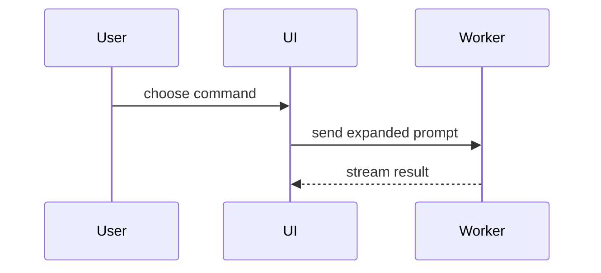

# Make PR reference

## Body scale

Load during Step 2 after the locked diff is non-empty. Measure only that
diff:

| Metric | Source |
|---|---|
| `files` | count of paths in `git diff --name-only <target>...HEAD` |
| `churn` | sum of added and deleted lines from `git diff --numstat <target>...HEAD` |
| `areas` | count of distinct top-level path segments among those files |

Pick **exactly one** tier with this order (first match wins):

1. **L** when `files` > 12, or `churn` > 400, or (`areas` ≥ 4 and `files` ≥ 8).
2. **S** when `files` ≤ 3 and `churn` ≤ 80.
3. **M** for every other non-empty diff.

| Tier | Summary bullets | Extra sections | Depth |
|---|---|---|---|
| S | 1–3 | none | Outcomes only. Name what changed for the user of the code. Skip deep call chains. Skip visuals. |
| M | 3–7 | Add `## Details` when two or more themes need more than one line each. Add a Body visuals sketch when a theme's shape needs more than one prose line. | Name key files and symbols the diff proves. State behavior change in plain words. |
| L | 5–12 | `## Details` required. Add `## Breaking` only when the diff proves a break. Add a Body visuals sketch when a theme changes a module, contract, or call path that one bullet cannot name. | Explain modules, contracts, and call-path deltas the hunks show. |

Rules for every tier:

- Cluster related hunks into themes. Never one bullet per commit.
- Bullet count is a range, not a quota. Cover each theme once. Do not pad.
- Default body always starts with `## Summary` and its bullets.
- Open extra sections only when the tier allows them **and** the locked
  diff supplies evidence for that section.
- Include no test, rollout, motive, or ticket claim the diff cannot prove.
- Never draft harness footers (`Made with Cursor`, identity trailers, peers).
- Record the chosen tier in the ledger next to title/body so Step 4 can
  restate it.

### Draft procedure

1. Measure `files`, `churn`, and `areas` from the locked diff.
2. Select the tier with the first-match order above.
3. Cluster hunks into themes.
4. Write `## Summary` bullets at that tier's depth and count range.
5. Add allowed extra sections only when evidence exists.
6. If the tier is M or L and a theme's shape needs a sketch, pick the
   smallest matching view from Body visuals. Place it next to the prose
   it supports.
7. Apply Body style below to every body sentence and bullet. Fence
   contents keep the view's syntax.
8. Map every title phrase, body line, and visual label to proving paths
   and hunks. Rewrite untraced copy.

Done when format, tier, Body style, Body visuals, and clean-room trace
all pass.

## Body visuals

Load during Step 2 after you cluster the themes. Load this section only
when the chosen tier is M or L and a theme's shape needs a sketch.

A visual is a fenced sketch next to the short prose it supports. Pick
the smallest view that makes that theme's key point clear. Keep only
calls, files, props, states, and boundaries the locked diff proves.
Place each visual beside its theme. Do not add a `## Visuals` section.
Use one view, or several for several themes. Do not use every view.

Rules:

- Delete a visual that names anything the locked diff does not prove.
  Include no motive, test, or rollout claim.
- Body style applies to the prose around a visual.
- Prefer Mermaid and `diff` fences. GitHub renders those in a PR body.
- Use fenced HTML or a linked file only when UI, layout, or state is too
  dense for Mermaid. Do not run a local open command.

### Pick the view

If the surrounding shape already exists and the point is the delta, use
a `diff` sketch of that same shape.

Otherwise match the theme's proved shape. The first matching row wins.

| Theme shape | View |
|---|---|
| Logic or algorithm | Pseudocode in a `text` fence |
| Runtime control flow | Call tree in a `text` fence |
| UI structure with state or module bounds | Component tree |
| File responsibility or a broad refactor | Shallow file tree |
| Interaction, control, or data flow | Mermaid |
| Most of the shape is new, omitted names hide order, or a copyable target is needed | Full block |
| UI, layout, or state too dense for Mermaid | One focused HTML fence or a linked file |

### Views

**Pseudocode.** Put logic or an algorithm in a `text` fence.

```text
on(save)
  if content is unchanged
    return cached result
  write new content
  return fresh result
```

**Call tree.** Put runtime control flow in a `text` fence.

```text
submitForm
  createSession
    persistPrompt
    launchAgent
  navigateToSession
```

**Component tree.** Name UI structure, plus state and module bounds that
matter.

```tsx
<CheckoutPage> (apps/web/src/routes/checkout.tsx)
  useCart()
  <CheckoutToolbar>
    <PayButton> (packages/ui)
```

**File tree.** Keep a responsibility or broad-refactor tree shallow.

```text
src/
├── commands/       # parses user actions
├── sessions/       # owns session state
└── transport/      # sends API requests
```

**Mermaid.** Put interaction, control flow, or data flow in a `mermaid`
fence.



**Diff sketch.** Match the `diff` fence to the theme's shape.

Component change:

```diff
 <CheckoutPage>
   useCart()
   <CheckoutToolbar>
+    <PayButton />
   <CheckoutTimeline>
+    <ReceiptCard />
```

File-layout change:

```diff
 src/
 ├── commands/
+│   └── parseCommand.ts  # parses the slash command
 ├── sessions/
-└── transport.ts
+└── transport/
+    ├── client.ts
+    └── stream.ts
```

Call-tree change:

```diff
 submitForm
   createSession
     persistPrompt
+    attachReceipt
     launchAgent
-  navigateToSession
+  navigateToSession
+    subscribeToEvents
```

State or control-flow change:

```diff
 on(save)
-  write content
+  if content is unchanged
+    return cached result
+  write new content
+  invalidate cache
```

**Full block.** Put the whole block when most of it is new, when omitted
names would hide ownership or order, or when the reviewer needs a
copyable target shape.

```ts
function parseCommand(input: string): Command {
  const name = input.slice(1)
  return { name, args: [] }
}
```

**HTML artifact.** Write one focused `html` fence or link one file.
Match product colors, type, spacing, and components. Use real labels
and data. Cover desktop and mobile. Prefer Mermaid or `diff` when
GitHub can render the point.

```html
<figure>
  <p>On desktop, Pay stays in the toolbar.</p>
  <p>On mobile, Pay stays pinned to the footer.</p>
</figure>
```

## Body style

Apply ASD-STE100 and Google developer documentation style to body prose
(not to path or symbol literals):

- Use one plain word for one act. Do not rotate synonyms (prefer start over
  begin, commence, or initiate).
- Write active voice. Name the actor: "The skill measures the diff."
- Use simple tenses: infinitive, imperative, simple present, simple past,
  or simple future. Prefer simple present or imperative. Avoid progressive
  and perfect when simple present suffices. Use present tense for current
  behavior. Keep -ing only for technical nouns, adjectives, or
  prepositions (`opening`, `remaining`, `during`). Rewrite other -ing
  verbs as imperative or simple present: "The handler starts the job."
  not "The skill is handling the job." Prefer "The skill runs the
  checks." over "The skill is running the checks."
- Keep instructional lines at 20 words or fewer. Keep descriptive bullets
  at 25 words or fewer.
- Keep one topic per sentence and one idea per bullet.
- Use a list when three or more parallel points appear.
- Address the reviewer or a future reader as you. Use imperative for any
  instruction (you is implied). Use third person for what the code does.
- Do not write we, let's, please, simply, easy, quickly, slang, or tl;dr.
  Do not use exclamation marks.
- Put a condition before its instruction: "If X, do Y."
- Use sentence-case headings (`## Summary`, `## Details`, `## Breaking`).
  Use serial commas.
- Keep articles (a, the) when they make grammar clear. Use American
  spelling.
- Keep necessary technical nouns (API names, flags, path segments). Put
  code, flags, and paths in code font. Define a rare term once in the same
  bullet if a stranger would misread it.
- Do not soften claims with empty hedges. If the diff does not prove a
  claim, delete the claim.
- Body states what changed and why the locked diff proves it, not how the
  implementation works. A Body visuals fence may name the proved shape.

Title lines: Pope/Beams imperative, no trailing period. Default title uses
sentence case and stays at most 60 characters. Conventional title follows
commit conventional rules (lowercase except names and technical terms, 50
characters, no scope, imperative, no period).

Provenance (principles only; do not copy the STE dictionary):
https://www.asd-ste100.org/STE_faq.html
https://developers.google.com/style
https://tbaggery.com/2008/04/19/a-note-about-git-commit-messages.html
https://cbea.ms/git-commit/

## Body hygiene

Load only during Step 4 verify after a create or update.

The published PR body must equal the ledger body. Harnesses and platform
hooks often append marketing footers after create or edit.

Banned additions (case-insensitive; strip whether freeform or `Key: value`):

- `Made with Cursor`, `Made-with: Cursor`, or Cursor product links used as a
  footer
- `Generated with Claude`, `Generated with Claude Code`, or similar Claude
  Code marketing lines
- `Co-authored-by:` / `Signed-off-by:` identity trailers in the PR body
- Any trailing block after the ledger body separated by a blank line that the
  ledger did not include

Detect: read the PR body back. Normalize only a single trailing newline for
comparison. Any other difference from the ledger body is dirty.

When dirty:

1. Update the PR body once to the exact ledger body. Change no other field.
2. Re-read the body. Any remaining difference from the ledger is `BLOCKED`;
   report the leftover lines.
3. Report whether a body strip ran.

Never draft banned footers in Step 2. Never treat a harness footer as part of
the summary.
