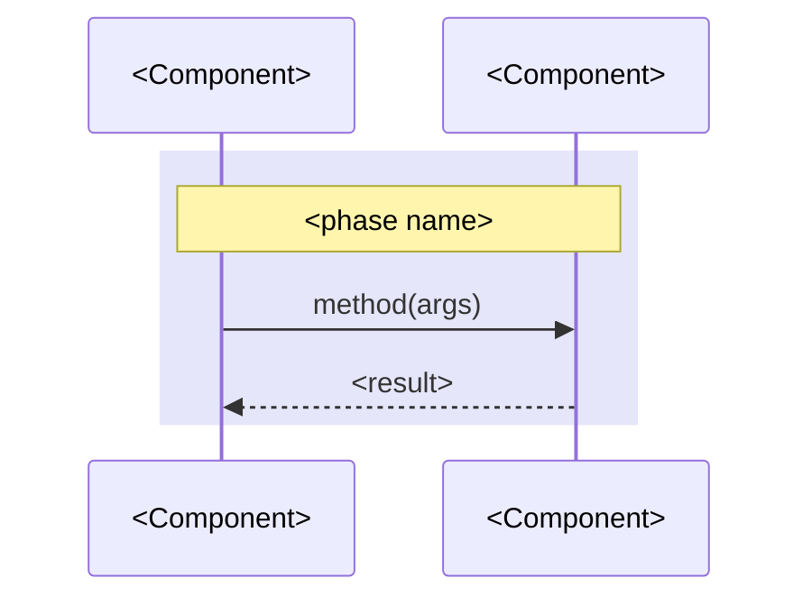

# Upfront design reference

Load the section for the step being entered. Rules live in `SKILL.md`; this
file holds templates.

## Design document template

Load in Step 0 when creating the file. Write one section per approved phase;
leave later sections absent until their phase is approved. Prose comes first
and each fenced block sits beside the prose it supports. Store repo roots as
absolute paths.

````markdown
---
request: <one-line request, or the path or URL it came from>
repos:
  - <absolute repo root>
created: <YYYY-MM-DD>
status: draft
---

# Design: <short title>

## Product review

### Problem to solve

<One paragraph: who starts where and what is missing.>

- <Concrete pain, quoting what the user does or says today>

### Success and how to measure it

- <Outcome stated as a change in behavior>
- Measurable signals: <counts, rates, or deltas readable from data>

### Proposed solution

**<One-line shape of the solution.>** <How it works and where it lives.>

<Mockup: supplied image path, or a text wireframe or state table labelled draft.>

<Delivery paragraph: how the user reaches it and how it ships.>

## System design

**<One-line shape statement naming the existing pattern it follows.>**
<Paragraph: what it parallels and what stays unchanged.>

```text
<contract path>    NEW        <role>
<api path>         CHANGED    <role>
<ui path>          NEW        <role>
```

<Paragraph: data sources, constraints, and the cost reason for each.>

ADR conflicts: <ADR-NNNN and the conflict, or none>



## Program design

### <Boundary thesis as one sentence>

<Paragraph: which pattern it follows and how callers use it.>

```<lang>
<usage snippet with real signatures and types>
```

```text
<boundary>
  <caller> -> <Service.method(args)>
```

```diff
 <dir>/
+  <new file>        # <role>
   <existing file>   # unchanged
```

```diff
 <caller dir>/
   <changed file>    # + <Service.method(args)>
```

```text
<entry>
  -> <callee>
    -> <callee>
```

<Paragraph: second shape considered and why it lost, or omit.>

## Vertical slices

- [ ] M1 <title>: <behavior delivered>
  - Path: <layers touched, in stub, mock, wire, logic, error handling order>
  - Symbols: <Phase 3 names landed here>
  - Automated verification:
    - [ ] `<exact command>` <caveat when the path or package matters>
  - Manual verification:
    - [ ] <step, then the observable result>
  - Deviations: none, or promised X; landed Y; reason
- [ ] M2 <title>: <behavior delivered> deferred (<reason or ticket>)

## Decisions

- <decision>: ADR at <absolute path>, or recorded here only
````

## ADR template

Load in Step 5 only, after a decision passes all three tests: hard to reverse,
surprising without context, chosen over a real alternative.

Qualifying categories: architectural shape, integration pattern between
components, technology that would take a quarter to swap, boundary and scope
no-s, deliberate deviation from the obvious path, non-obvious rejected
alternative.

Numbering: scan the ADR tree for the highest `NNNN-` prefix and add one. Name
the file `NNNN-<slug>.md`. Create the tree only when writing the first ADR.

```markdown
# <Short title of the decision>

<One to three sentences: the context, the decision, and why.>
```

Optional sections, added only when they carry information the body lacks:
`Status` (`proposed`, `accepted`, `deprecated`, `superseded by ADR-NNNN`),
`Considered Options`, `Consequences`.

## Check report format

Load in Check only.

```text
milestone: M<n> <title>
automated:
  `<command>` | pass | fail (exit <code>)
manual:
  <step> | confirmed | unconfirmed
symbols:
  <promised name and signature> | landed | missing | changed: <detail>
result: ticked | awaiting manual | deviation
next: M<n+1> | all milestones complete
deferred: <M<n> and unlanded symbols, or none>
```
